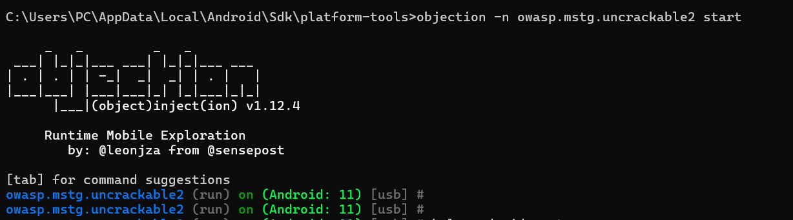
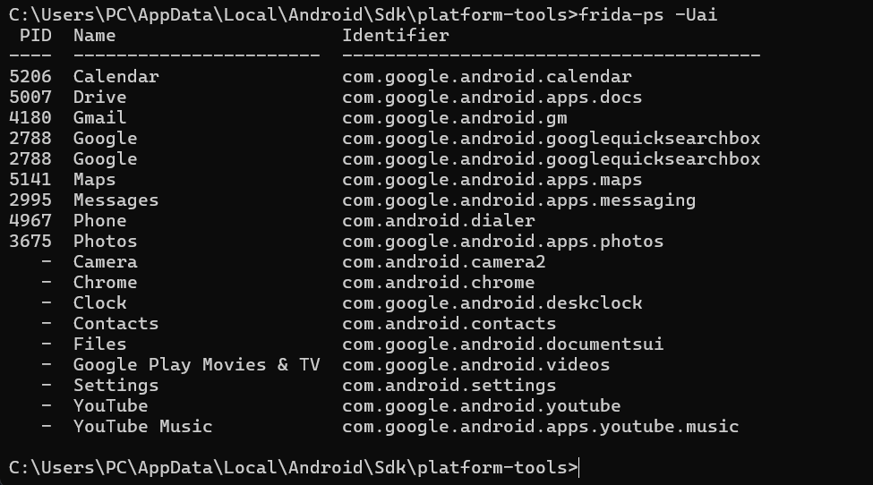
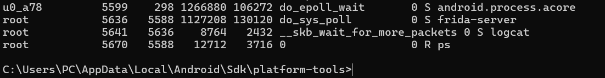
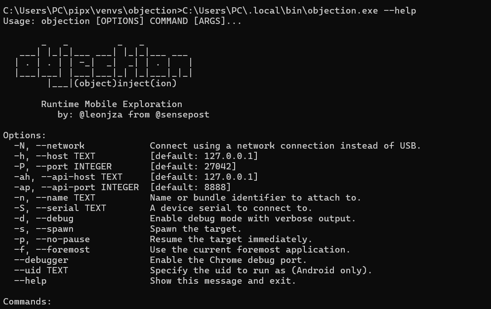
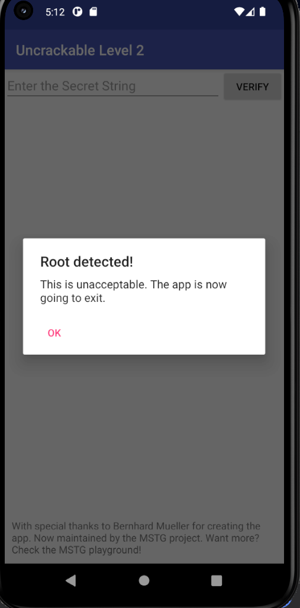
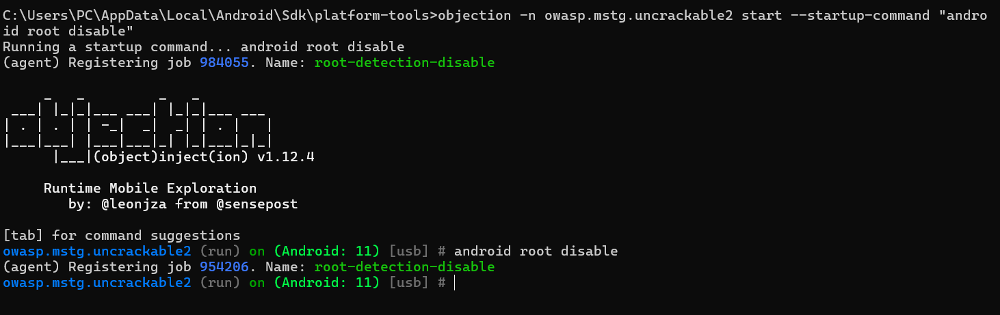
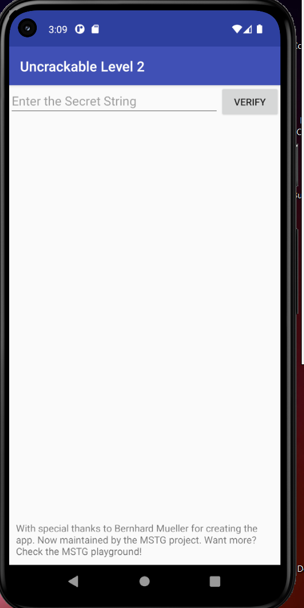

1. Preuve d’installation et de connexion

Commande :
objection --version

Résultat :
objection v1.12.4

Preuve :

Commande :
adb devices

Résultat :
Le device emulator-5554 est détecté.

Conclusion :
ADB fonctionne correctement et l’émulateur est connecté.

2. Démarrage et visibilité

Vérification des applications avec Frida :

Commande :
frida-ps -Uai

Résultat :
Liste des applications visibles.

Preuve :

Lancement du serveur Frida :

Preuve que frida-server est actif :

Lancement Objection :

Commande :
objection -n owasp.mstg.uncrackable2 start

Résultat :
Connexion réussie avec l’application.

Preuve :

Conclusion :
Objection est correctement attaché à l’application.

3. Bypass Java avec Objection

Avant bypass :

L’application affiche :
"Root detected! This is unacceptable. The app is now going to exit."

Preuve :

Conclusion :
Le root est bien détecté.

Exécution du bypass :

Commande :
android root disable

Résultat :
Le module root-detection-disable est activé.

Preuve :

Après bypass :

L’application démarre normalement sans afficher le message "Root detected".

Preuve :

Conclusion :

Le bypass de la détection de root via Objection fonctionne correctement.

Conclusion générale

L’environnement est correctement configuré avec ADB, Frida et Objection.
La connexion à l’application est réussie.
Le bypass root avec android root disable fonctionne.
